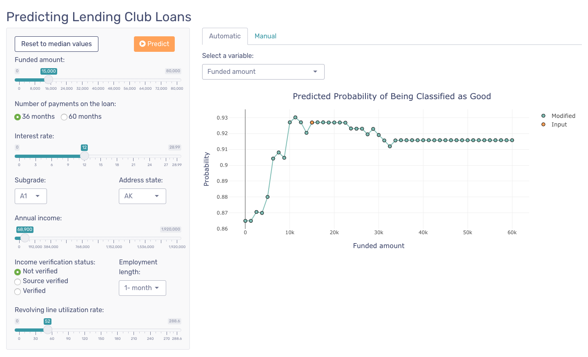
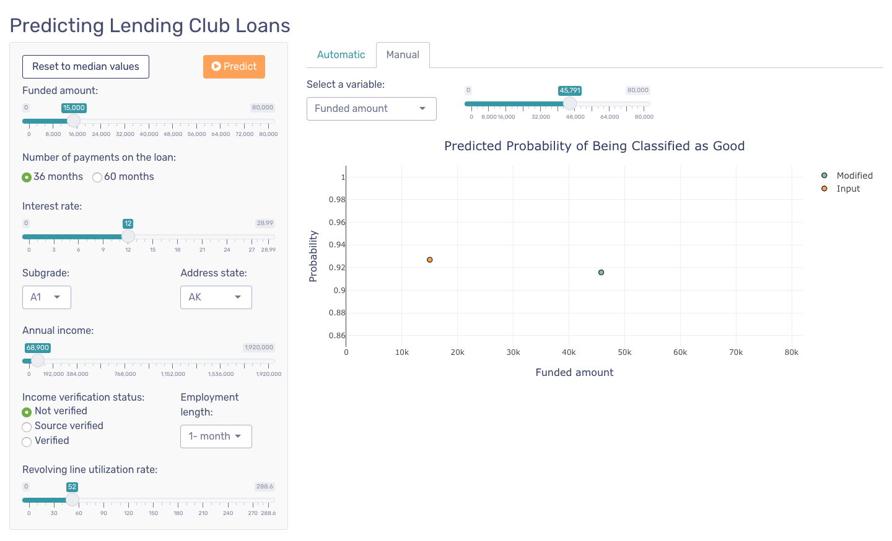

```{r setup, include=FALSE}
knitr::opts_chunk$set(echo = TRUE, message=FALSE, warning=FALSE, fig.align = "center", cache=TRUE)
```

```{r libraries}
# SEE modeldata package for new datasets
library(xlsx)
library(tidyverse)         # for graphing and data cleaning
library(tidymodels)        # for modeling
library(stacks)            # for stacking models
library(naniar)            # for examining missing values (NAs)
library(lubridate)         # for date manipulation
library(moderndive)        # for King County housing data
library(vip)               # for variable importance plots
library(DALEX)             # for model interpretation  
library(DALEXtra)          # for extension of DALEX
library(patchwork)         # for combining plots nicely
theme_set(theme_minimal()) # Lisa's favorite theme
options(scipen=999)
```

```{r data}
data("lending_club")
# Data dictionary (as close as I could find): https://www.kaggle.com/wordsforthewise/lending-club/discussion/170691
```


When you finish the assignment, remove the `#` from the options chunk at the top, so that messages and warnings aren't printed. If you are getting errors in your code, add `error = TRUE` so that the file knits. I would recommend not removing the `#` until you are completely finished.

## Put it on GitHub!        

From now on, GitHub should be part of your routine when doing assignments. I recommend making it part of your process anytime you are working in R, but I'll make you show it's part of your process for assignments.

**Task**: When you are finished with the assignment, post a link below to the GitHub repo for the assignment. If you want to post it to your personal website, that's ok (not required). Make sure the link goes to a spot in the repo where I can easily find this assignment. For example, if you have a website with a blog and post the assignment as a blog post, link to the post's folder in the repo. As an example, I've linked to my GitHub stacking material [here](https://github.com/llendway/ads_website/tree/master/_posts/2021-03-22-stacking).

https://github.com/thytng/stat494-assignment2

## Modeling

Before jumping into these problems, you should read through (and follow along with!) the [model stacking](https://advanced-ds-in-r.netlify.app/posts/2021-03-22-stacking/) and [global model interpretation](https://advanced-ds-in-r.netlify.app/posts/2021-03-24-imlglobal/) tutorials on the Course Materials tab of the course website.

We'll be using the `lending_club` dataset from the `modeldata` library, which is part of `tidymodels`. The data dictionary they reference doesn't seem to exist anymore, but it seems the one on this [kaggle discussion](https://www.kaggle.com/wordsforthewise/lending-club/discussion/170691) is pretty close. It might also help to read a bit about [Lending Club](https://en.wikipedia.org/wiki/LendingClub) before starting in on the exercises.

The outcome we are interested in predicting is `Class`. And according to the dataset's help page, its values are "either 'good' (meaning that the loan was fully paid back or currently on-time) or 'bad' (charged off, defaulted, of 21-120 days late)".

**Tasks:** I will be expanding these, but this gives a good outline.

1. Explore the data, concentrating on examining distributions of variables and examining missing values. 

**Loading the data dictionary downloaded from Kaggle:**

```{r dict}
(dict <- read.xlsx("LCDataDictionary.xlsx", sheetIndex = 1)[,1:2] %>%
   filter(LoanStatNew %in% names(lending_club))) 
```
**Exploring numerical variables:**

```{r expl-quant, fig.width=8, fig.height=6}
lending_club %>%
  select(where(is.numeric)) %>%
  pivot_longer(cols = everything(),
               names_to = "variable",
               values_to = "values") %>%
  ggplot(aes(x = values)) +
  geom_histogram() +
  facet_wrap(vars(variable),
             scales = "free")
```

**Categorical variables:**

```{r expl-cat, fig.width=8, fig.height=6}
lending_club %>%
  select(is.factor) %>%
  pivot_longer(cols = everything(),
               names_to = "variable",
               values_to = "value") %>%
  ggplot(aes(x = value)) +
  geom_bar() +
  facet_wrap(~variable, 
             scale = "free") +
  theme(axis.text.x = element_text(angle = 30, hjust = 1, size = 6))
```

**Checking for missing data:**

```{r missing}
lending_club %>%
  add_n_miss() %>%
  count(n_miss_all)
```


2. Do any data cleaning steps that need to happen before the model is build. For example, you might remove any variables that mean the same thing as the response variable (not sure if that happens here), get rid of rows where all variables have missing values, etc. 

**There's no missing / null data and I couldn't find any redundant variables. `emp_length` is a bit tricky because it should be the employment length in years but the variable is categorical in the data. I can make it continuous but there are categories for less than 1 year, more than 9 years, and unknown so it's probably best to leave it untouched.**

Be sure to add more "bad" Classes. This is not the best solution, but it will work for now. (Should investigate how to appropriately use `step_sample_up()` function from [`themis`](https://github.com/tidymodels/themis)).

```{r}
create_more_bad <- lending_club %>% 
  filter(Class == "bad") %>% 
  sample_n(size = 3000, replace = TRUE)

lending_club_mod <- lending_club %>% 
  bind_rows(create_more_bad)
```

3. Split the data into training and test, putting 75\% in the training data.

```{r init-split}
set.seed(494) # for reproducibility
lc_split <- initial_split(lending_club_mod, prop = .75)
lc_training <- training(lc_split)
lc_testing <- testing(lc_split)
```

4. Set up the recipe and the pre-processing steps to build a lasso model. Some steps you should take:

* Make all integer variables numeric (I'd highly recommend using `step_mutate_at()` or this will be a lot of code). We'll want to do this for the model interpretation we'll do later.  
* Think about grouping factor variables with many levels.  
* Make categorical variables dummy variables (make sure NOT to do this to the outcome variable).  
* Normalize quantitative variables.  

```{r lasso-recipe}
lc_lasso_recipe <- recipe(Class ~ ., data = lending_club_mod) %>%
  # convert all integers to numerics
  step_mutate_at(is.integer, fn = as.numeric) %>%
  step_mutate(
    # merge all subgrades with the same letter grade into one category
    grade = substr(sub_grade, 0, 1),
    # convert address state to address region
    addr_region = fct_relevel(
      case_when(
        addr_state %in% c("CT", "MA", "ME", "NH", "RI", "VT") ~ "Northeast",
        addr_state %in% c("DE", "MD", "NJ", "NY", "PA", "DC") ~ "Mid-Atlantic",
        addr_state %in% c("AL", "AR", "FL", "GA", "KY", "LA", 
                          "MS", "NC", "SC", "TN", "VA", "WV") ~ "South",
        addr_state %in% c("IA", "IL", "IN", "KS", "MI", "MN", 
                          "MO", "ND", "NE", "OH", "SD", "WI") ~ "Midwest",
        addr_state %in% c("AK", "CA", "CO", "HI", "ID", "MT", 
                          "NV", "OR", "UT", "WA", "WY") ~ "West",
        addr_state %in% c("AZ", "NM", "OK", "TX") ~ "Southwest"
        ))) %>%
  # add a constant to the variables we will log-transform because there are 0s in the data
  step_mutate_at(annual_inc, delinq_amnt, total_bal_il, total_il_high_credit_limit, 
                 fn = function(x) x+1) %>%
  # log transform with base 10
  step_log(annual_inc, delinq_amnt, total_bal_il, total_il_high_credit_limit, base = 10) %>%
  # remove the old categorical variables that we refactored
  step_rm(sub_grade, addr_state) %>%
  step_mutate_at(grade, fn = as.factor) %>%
  # create dummy variables for categorical vars
  step_dummy(all_nominal(), -all_outcomes()) %>%
  # normalize quantitative vars
  step_normalize(all_predictors(), -all_nominal()) 
```

```{r}
lc_lasso_recipe %>%
  prep(lc_training) %>%
  juice() 
```


5. Set up the lasso model and workflow. We will tune the `penalty` parameter.

```{r lasso-mod}
lc_lasso_mod <- 
  logistic_reg(mixture = 1) %>%
  set_engine("glmnet") %>%
  set_args(penalty = tune()) %>%
  set_mode("classification")
```

```{r lasso-wf}
lc_lasso_wf <- workflow() %>%
  add_recipe(lc_lasso_recipe) %>%
  add_model(lc_lasso_mod)
```


6. Set up the model tuning for the `penalty` parameter. Be sure to add the `control_stack_grid()` for the `control` argument so we can use these results later when we stack. Find the accuracy and area under the roc curve for the model with the best tuning parameter. Use 5-fold cv.

```{r lasso-tune}
set.seed(494) 
penalty_grid <- grid_regular(penalty(), levels = 4)
ctrl_grid <- control_stack_grid()
metric <- metric_set(roc_auc)
lc_cv <- vfold_cv(lc_training, v = 5)

lc_lasso_tune <- lc_lasso_wf %>%
  tune_grid(resamples = lc_cv,
            grid = penalty_grid,
            control = ctrl_grid, 
            metrics = metric)
```


7. Set up the recipe and the pre-processing steps to build a random forest model. You shouldn't have to do as many steps. The only step you should need to do is making all integers numeric. 

```{r rf-recipe}
lc_rf_recipe <- recipe(Class ~ ., data = lending_club_mod) %>%
  step_mutate_at(is.integer, fn = as.numeric) 
```

8. Set up the random forest model and workflow. We will tune the `mtry` and `min_n` parameters and set the number of trees, `trees`, to 100 (otherwise the next steps take too long).

```{r rf-mod}
lc_rf_mod <- rand_forest(mtry = tune(), 
                         min_n = tune(), 
                         trees = 100) %>% 
  set_mode("classification") %>% 
  set_engine("ranger")
```

```{r rf-wf}
lc_rf_wf <- workflow() %>%
  add_recipe(lc_rf_recipe) %>%
  add_model(lc_rf_mod)
```

9. Set up the model tuning for both the `mtry` and `min_n` parameters. Be sure to add the `control_stack_grid()` for the `control` argument so we can use these results later when we stack. Use only 3 levels in the grid. For the `mtry` parameter, you need to put `finalize(mtry(), lending_training %>% select(-Class))` in as an argument instead of just `mtry()`, where `lending_training` is the name of your training data. This is because the `mtry()` grid will otherwise have unknowns in it. This part can take a while to run.

```{r rf-tune}
rf_grid <- grid_regular(finalize(mtry(), lc_training %>% select(-Class)),
                        min_n(),
                        levels = 3)

lc_rf_tune <- lc_rf_wf %>%
  tune_grid(resamples = lc_cv,
            control = ctrl_grid,
            grid = rf_grid,
            metrics = metric)
```

10. Find the best tuning parameters. What is the are the accuracy and area under the ROC curve for the model with those tuning parameters?

```{r lasso-best-tune}
best_lasso_param <- lc_lasso_tune %>%
  select_best()

lc_lasso_tune %>%
  collect_metrics() %>%
  filter(penalty == best_lasso_param$penalty)
```

```{r rf-best-tune}
best_rf_param <- lc_rf_tune %>%
  select_best()

lc_rf_tune %>%
  collect_metrics() %>%
  filter(mtry == best_rf_param$mtry & min_n == best_rf_param$min_n)
```

11. Use functions from the `DALEX` and `DALEXtra` libraries to create a histogram and boxplot of the residuals from the training data. How do they look? Any interesting behavior?

```{r final-mods}
# fit final models
lc_lasso_final_mod <- lc_lasso_wf %>%
  finalize_workflow(best_lasso_param) %>%
  fit(data = lc_training)

lc_rf_final_mod <- lc_rf_wf %>%
  finalize_workflow(best_rf_param) %>%
  fit(data = lc_training)
```

```{r explainers, fig.width=8, fig.height=5}
# create explainers 
lasso_explain <- 
  explain_tidymodels(
    model = lc_lasso_final_mod,
    data = lc_training %>% select(-Class), 
    y = lc_training %>% mutate(Class_num = as.integer(Class =="good")) %>% pull(Class_num),
    label = "lasso",
    type = "classification"
  )

rf_explain <- 
  explain_tidymodels(
    model = lc_rf_final_mod,
    data = lc_training %>% select(-Class), 
    y = lc_training %>% mutate(Class_num = as.integer(Class =="good")) %>% pull(Class_num),
    label = "rf",
    type = "classification"
  )

# get model evaluation metrics
lasso_perf <- model_performance(lasso_explain, type = "classification")
rf_perf <- model_performance(rf_explain)

# make the plots
hist_plot <- plot(rf_perf, lasso_perf, geom = "histogram")
box_plot <- plot(lasso_perf, rf_perf, geom = "boxplot")

hist_plot + box_plot
```

**Between the random forest model and LASSO, the residuals from the former look much better. They center around 0, have a smaller spread, and the RMSE is very close to 0.**

12. Use `DALEX` functions to create a variable importance plot from this model. What are the most important variables? 

```{r var-imp, fig.width=10, fid.height=6}
set.seed(494) 

lasso_var_imp <- model_parts(lasso_explain)
rf_var_imp <- model_parts(rf_explain)
plot(lasso_var_imp, show_boxplots = TRUE) + plot(rf_var_imp, show_boxplots = TRUE)
```

**The four most important variables from LASSO are `int_rate`, `total_bal_il`, `total_il_high_credit_limit`.**

**For random forest, they are `int_rate`, `sub_grade`, `annual_inc`, `open_il_12m`.**

13. Write a function called `cp_profile` to make a CP profile. The function will take an explainer, a new observation, and a variable name as its arguments and create a CP profile for a quantitative predictor variable. You will need to use the `predict_profile()` function inside the function you create - put the variable name there so the plotting part is easier. You'll also want to use `aes_string()` rather than `aes()` and quote the variables. Use the `cp_profile()` function to create one CP profile of your choosing. Be sure to choose a variable that is numeric, not integer. There seem to be issues with those that I'm looking into.

```{r cpp}
cp_profile <- function(explainer, new_obs, var_name) {
  cpp <- predict_profile(explainer = explainer, new_observation = new_obs, variables = var_name) 
  
  cpp %>%
    rename(yhat = `_yhat_`) %>%
    filter(`_vname_` %in% c(var_name)) %>%
    ggplot(aes_string(x = var_name, y = "yhat")) +
    geom_line()
}
```

```{r fig.width=5, fig.height=4}
set.seed(494)
cp_profile(rf_explain, lc_training %>% sample_n(size = 1), "int_rate")
```

For an extra challenge, write a function that will work for either a quantitative or categorical variable. 

If you need help with function writing check out the [Functions](https://r4ds.had.co.nz/functions.html) chapter of R4DS by Wickham and Grolemund.

14. Use `DALEX` functions to create partial dependence plots (with the CP profiles in gray) for the 3-4 most important variables. If the important variables are categorical, you can instead make a CP profile for 3 observations in the dataset and discuss how you could go about constructing a partial dependence plot for a categorical variable (you don't have to code it, but you can if you want an extra challenge). If it ever gives you an error that says, "Error: Can't convert from `VARIABLE` <double> to `VARIABLE` <integer> due to loss of precision", then remove that variable from the list. I seem to have figured out why it's doing that, but I don't know how to fix it yet.

```{r pdp, fig.width=7, fig.height=5}
set.seed(494) 
rf_pdp <- model_profile(
  explainer = rf_explain,
  variables = c("int_rate", "annual_inc", "open_il_12m"))

plot(rf_pdp, 
     variables = c("int_rate", "annual_inc", "open_il_12m"),
     geom = "profiles")
```

15. Fit one more model type of your choosing that will feed into the stacking model. 

```{r knn}
# create a model definition
lc_knn_mod <-
  nearest_neighbor(
    neighbors = tune("k")
  ) %>%
  set_engine("kknn") %>% 
  set_mode("classification")

# create the workflow
lc_knn_wf <- 
  workflow() %>% 
  add_model(lc_knn_mod) %>%
  add_recipe(lc_lasso_recipe)

# tune it using 4 tuning parameters
lc_knn_tune <- 
  lc_knn_wf %>% 
  tune_grid(
    lc_cv,
    metrics = metric,
    grid = 4,
    control = ctrl_grid
  )
```


16. Create a model stack with the candidate models from the previous parts of the exercise and use the `blend_predictions()` function to find the coefficients of the stacked model. Create a plot examining the performance metrics for the different penalty parameters to assure you have captured the best one. If not, adjust the penalty. (HINT: use the `autoplot()` function). Which models are contributing most?

```{r stack}
lc_stack <- 
  stacks() %>% 
  add_candidates(lc_rf_tune) %>% 
  add_candidates(lc_lasso_tune) %>% 
  add_candidates(lc_knn_tune)
```

```{r blend, fig.width=5, fig.height=4}
(lc_blend <- 
   lc_stack %>%
   blend_predictions())

autoplot(lc_blend)
```

**Random forest is the only model that was retained. I got varying results by changing the parameters to the previous tuning steps but overall it seems like random forest always came out on top with the greatest weight. The coefficients on the other models when they were included were very small (around or less than 1). This also made the final model smaller in terms of file size because it could exceed 100 MB and if so then I wouldn't be able to upload to Github.**

17. Fit the final stacked model using `fit_members()`. Apply the model to the test data and report the accuracy and area under the curve. Create a graph of the ROC and construct a confusion matrix. Comment on what you see. Save this final model using the `saveRDS()` function - see the [Use the model](https://advanced-ds-in-r.netlify.app/posts/2021-03-16-ml-review/#use-the-model) section of the `tidymodels` intro. We are going to use the model in the next part. You'll want to save it in the folder where you create your shiny app.

```{r final-stack, fig.width=5, fig.height=4}
(lc_final_stack <- lc_blend %>%
   fit_members)

# make predictions on test data
(lc_stack_preds <- 
    cbind(lc_final_stack %>% predict(new_data = lc_testing),
          lc_final_stack %>% predict(new_data = lc_testing, type = "prob")) %>%
    bind_cols(lc_testing) %>%
    relocate(Class, .after = .pred_good))
  
# ROC AUC
lc_stack_preds %>%
  # the Class level is (bad, good) so we need to specify that the event is the second one
  roc_auc(.pred_good, truth = Class, event_level = "second")

# accuracy
lc_stack_preds %>%
  # the Class level is (bad, good) so we need to specify that the event is the second one
  accuracy(.pred_class, truth = Class, event_level = "second")

# graph of ROC
lc_stack_preds %>%
  # the Class level is (bad, good) so we need to specify that the event is the second one
  roc_curve(.pred_good, truth = Class, event_level = "second") %>%
  ggplot(aes(x = 1 - specificity, y = sensitivity)) +
  geom_path() +
  geom_abline(lty = 3) +
  coord_equal() +
  labs(y = "True Positive Rate (Sensitivity)",
       x = "False Positive Rate",
       fill = NULL,
       title = "ROC Curve",
       subtitle = "Stack Model")

# confusion matrix
lc_stack_preds %>%
  conf_mat(Class, .pred_class) %>%
  pluck(1) %>%
  as_tibble() %>%
  ggplot(aes(Prediction, Truth, alpha = n)) +
  geom_tile(show.legend = FALSE) +
  geom_text(aes(label = n), colour = "white", alpha = 1, size = 8) +
  theme(panel.grid.major = element_blank()) +
  labs(y = "Actual Class",
       x = "Predicted Class",
       fill = NULL,
       title = "Confusion Matrix",
       subtitle = "Stack Model")
```

**The ideal ROC curve is one that goes high up the upper-left corner and that is the behavior we see in the plot. On top of this, almost all of the observations in the test data were classified correctly.**

```{r eval=FALSE}
saveRDS(lc_final_stack, "lending_club_stack_fit.rds")
```

## Shiny app

If you are new to Shiny apps or it's been awhile since you've made one, visit the Shiny links on our course [Resource](https://advanced-ds-in-r.netlify.app/resources.html) page. I would recommend starting with my resource because it will be the most basic. You won't be doing anything super fancy in this app. 

Everyone should watch the [Theming Shiny](https://youtu.be/b9WWNO4P2nY) talk by Carson Sievert so you can make your app look amazing.

**Tasks:**

You are going to create an app that allows a user to explore how the predicted probability of a loan being paid back (or maybe just the predicted class - either "good" or "bad") changes depending on the values of the predictor variables.

Specifically, you will do the following:

* Set up a separate project and GitHub repo for this app. Make sure the saved model from the previous problem is also in that folder. The app needs to be created in a file called *exactly* app.R that is also in the project folder.   
* At the top of the file, load any libraries you use in the app.  
* Use the `readRDS()` function to load the model.  
* You may want to load some of the data to use
* Create a user interface (using the various `*Input()` functions) where someone could enter values for each variable that feeds into the model. You will want to think hard about which types of `*Input()` functions to use. Think about how you can best prevent mistakes (eg. entering free text could lead to many mistakes). 
* Another part of the user interface will allow them to choose a variable (you can limit this to only the quantitative variables) where they can explore the effects of changing that variable, holding all others constant.  
* After the user has entered all the required values, the output will be a CP profile with the the predicted value for the data that was entered, indicated by a point. I don't think the functions from `DALEX` and `DALEXtra` will work with a stacked model, so you'll likely have to (get to) do some of your own coding. 
* Use the `bslib` to theme your shiny app!  
* Publish your app to [shinyapps.io](https://www.shinyapps.io/). There are instructions for doing that on the tutorial I linked to above.   
* Write a paragraph or two describing your app on your website! Link to the app and your GitHub repository in your post. Include a link to your post here. 

**I'm using blogdown for my website but I'm struggling to publish a post... I will work on it but here is what I wrote:**

Using the Lending Club data, I further explored the R package tidymodels and learned about model stacking and interpretation to classify loans as either good or bad. I then created a Shiny web app where I really took time to understand the structure of an app, the reactive components and functions, and some basic styling. 

Well, [here](https://thytng.shinyapps.io/shiny-lending-club/?_ga=2.205953491.1396798748.1617376629-595203214.1617376629) is the final product!



The sidebar allows the user to enter in data values to create a new loan observation. This observation will be registered once the "Predict" button is clicked (in other words, it will not be updated each time a variable is changed). In this Automatic tab there is a dropdown menu to select a predictor to vary. The plot below is a CP profile, showing the different probabilities for the observation when this variable is changed, holding all others fixed. Right now, only quantitative variables are allowed for continuous plotting. 



In this second tab, the user can select a variable (once again, quantitative only) and adjust its value to see the new predicted probability. It serves essentially the same function as the first tab, only it gives the user more control. The plot shows two data points, one is the observation created with the input values from the sidebar, and the other is the same observation but with this updated variable. Every time the slider is adjusted, the program updates the latter and moves its marker to the new predicted value. 

I initially tried to create a new data point each time the variable is changed to populate the plot and make it more interesting, but combined with how the user can also change the sidebar inputs to update the observation, the reactive values turned out to be very tricky to capture. This is the part where I definitely want to revisit in the future.

Some helpful libraries and resources I used for this project are:

* [tidymodels](https://www.tidymodels.org) for modeling,
* [The Shiny cheat sheet](https://shiny.rstudio.com/images/shiny-cheatsheet.pdf),
* [Plotly R](https://plotly.com/r/) for interactive visualizations,
* [Color Hunt](https://colorhunt.co) for color palette inspiration, and
* [bslib](https://plotly.com/r/) because styling Shiny apps is a pain.

## Coded Bias

Watch the [Code Bias](https://www.pbs.org/independentlens/films/coded-bias/) film and write a short reflection. If you want some prompts, reflect on: What part of the film impacted you the most? Was there a part that surprised you and why? What emotions did you experience while watching?

**I thought that Coded Bias was excellent. It covers all of the most pressing issues posed by AI technology that we currently face in a way that was very digestible. There was nothing overly technical about the discussions that were brought up, which made the film approachable to a wide audience beyond those who work in tech. I think this is crucial as these types of software are being deployed on a large scale in a wide variety of fields. As they have access to people’s data and make decisions that can have very serious consequences, people first need to be made aware that their privacy and data are being monitored and potentially exploited. It is one thing for a person to be less careful about their online presence because a company might be tracking their activity, but it becomes very serious the outcomes of their job application, health insurance, credit score, etc. are being decided by an essentially black-box process and that they have no idea this is what happens behind the scenes. If they do not know and blindly accept these decisions then how can they appeal when the system is inaccurate? Personally, what’s more troubling is that even the people behind these algorithms cannot fully explain how they arrived at those decisions on a case-by-case basis. This is something that was voiced by many speakers in the movie so it truly is alarming how these tools were deployed without first being thoroughly evaluated and tested by parties that are knowledgeable about the subject at hand.**

**This is where guidelines and regulations really need to come in. First and foremost we need to limit the amount and kind of data companies and the state can collect and share and to be transparent about data collection and usage. For example in the case of facial recognition technology, people should not be screened without knowledge let alone consent when there is no evidence of them having violated something. People need to know what their personal data is being used for and who potentially stands to profit from it. Furthermore, when it comes to algorithms, although many of them are proprietary, the government and other monitoring agencies can still enforce regulations and evaluation processes that they must comply with before being deployed. Along the same lines, decisions made by algorithms need to be transparent and come with an explanation. People have the right to know why and evidently the agencies using these algorithms also need to fully understand the decisions they ultimately authorize. If left unchecked then we are going down this path where, as one of the speakers said, we would be implicitly nudged and influenced by decisions made by corporations and governments that are not always acting in our best interests. Moreover, we need to address how these issues disproportionately affect marginalized or targeted groups. These algorithms not only run on data but also produce data as they are making predictions, classifications, etc. so they can seriously aggravate injustices and inequities.**

**Ultimately, I do believe that technology is powerful and can advance and revolutionize our lives but we need to ensure that the benefits and progress are equitably distributed to all members of society. Of course the public need to be aware but they can only know to an extent. People working in AI, researchers, and policy-makers should shoulder most of the responsibility for creating, evaluating, and monitoring these tools to ensure that their use will be appropriate and just.**


REMEMBER TO ADD YOUR GITHUB LINK AT THE TOP OF THE PAGE AND UNCOMMENT THE `knitr` OPTIONS.


